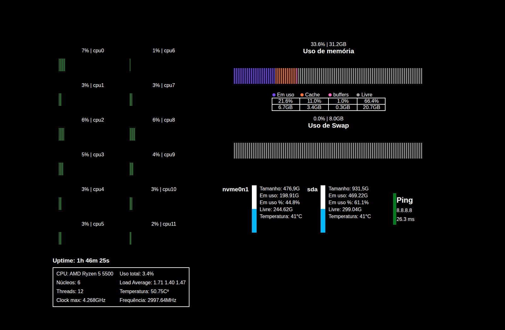

# Software Monitor

Este é um software simples para monitoramento de servidores Linux via interface web.

## :clipboard: Features

- Monitoramento remoto

- Atualização em tempo real dos valores de rede, memória, CPU e discos

- Informações técnicas básicas da CPU, memórias e discos

- ~~Monitoramento de TX/RX~~ Planejado

- ~~Timers de atualização configuráveis~~ Planejado

- ~~Design mobile~~ Planejado

- ~~Lista de processos ativos em tempo real~~ Planejado

## :books: Sobre o projeto e inspiração

Este projeto é inspirado primariamente no [htop](https://github.com/htop-dev/htop), porém também possui elementos inspirados no Gerenciador de Tarefas do Windows. A proposta é uma mescla de ambos, com a possibilidade de monitorar tudo remotamente pela rede.

### Design

O design foi pensado para ser minimalista e intuitivo, com algumas animações simples de transição. O objetivo é manter a interface agradável visualmente e evitar atualizações bruscas.
Também foram adicionadas animações relacionadas à coloração, principalmente ligadas ao load das CPUs e temperaturas, com o intuito de sinalizar valores elevados nesses campos.

### Compatibilidade

O software é compatível apenas com Linux, pois utiliza comandos exclusivos do sistema para extração de informações, como lsblk e lscpu.
É possível adaptar para Windows, porém isso não está nos planos atuais do projeto. Talvez em uma atualização futura, mas não há previsão.

### Acesso Web

O projeto foi pensado para ser acessado pela rede. A interface web possibilita o monitoramento remoto, podendo ser utilizada via túnel Cloudflare ou IP fixo.

### Tecnologias

-Python
 -É o motor do projeto. Responsável por coletar todas as informações de hardware e monitoramento para que o JavaScript possa buscar e atualizar os valores na interface.

-Flask
 -Framework web base do projeto. Responsável por sustentar a comunicação entre as partes do sistema e hospedar a aplicação no domínio local.

-JavaScript
 -Responsável pelo frontend. Busca as informações fornecidas pelo Python, atualiza os dados em tempo real na interface e executa as animações.

-HTML
  -Estrutura básica da interface web.

-CSS
 -Utilizado para estilização estática e adaptação para diferentes dispositivos e resoluções.

## :black_joker: Instalação

Após baixar os arquivos do projeto, abra o terminal no diretório do projeto e execute os seguintes comandos:

`sudo chmod +x install.sh`

`sudo ./install.sh`

Após isso, o serviço já deve estar funcionando. Para acessar a interface, utilize:

http://127.0.0.1:5000/

### Desinstalação

Para desinstalar o software, acesse o diretório onde ele está instalado `/opt/servermonitor/` e execute:

`sudo chmod +x uninstall.sh`

`sudo ./uninstall.sh`

## :computer: Requisitos

Nada muito específico. Uma máquina com Linux baseado em Debian/Ubuntu.

A máquina mais fraca utilizada nos testes possui um Celeron J1800 e 4 GB de RAM, sem apresentar problemas.
O consumo chega a ser maior na máquina que acessa a interface web do que no servidor que executa o programa.
Em termos de hardware, a princípio, o software deve rodar sem problemas na maioria dos sistemas.

## :game_die: Uso

O monitoramento foi implementado como um daemon, ou seja, o serviço inicia automaticamente junto com o boot do sistema.
Para acessar, basta abrir o navegador e acessar o endereço local.

O serviço já fica exposto para a rede local assim que está em execução. Caso a máquina possua um IP válido, basta liberar o acesso na rede e acessar via IP:5000.
Utilizando túnel, o processo é semelhante: basta vincular o túnel à porta 5000 para acesso externo.

## :eyes: Privacidade

Para executar comandos de verificação SMART dos discos, é necessário acesso root.
Por esse motivo, foi criado um arquivo específico `smarthelper.py` com permissão root apenas para realizar essas operações.
Ele se comunica com o processo principal através de um socket Unix.

Também é necessário acesso root durante a instalação, pois são realizadas instalações de bibliotecas e pacotes necessários para o funcionamento do sistema.
